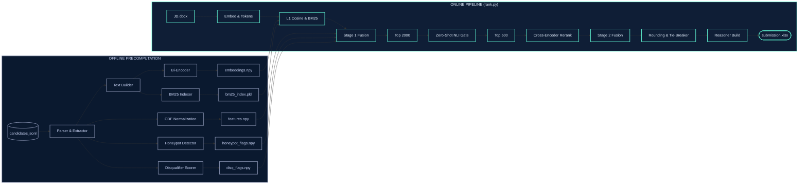

# REDROB AI CANDIDATE RANKER
## Intelligent Candidate Discovery & Multi-Stage Ranking Pipeline
*Presented by: team_404_Founders*

---

### Slide 1: Solution Overview
* **Proposed Architecture**: A Hybrid Multi-Stage Retrieval and Reranking Pipeline.
  * **Phase 1 (Offline)**: Processes 100K candidate profiles, pre-screens honeypots, runs statistical CDF normalization, and precomputes dense bi-encoder embeddings (`all-MiniLM-L6-v2`) and BM25 lexical indexes.
  * **Phase 2 (Online)**: Executes in under 120 seconds on CPU. Matches the JD, runs zero-shot NLI logic filters for relocation/work mode constraints, reranks the top 500 via a Cross-Encoder (`ms-marco-MiniLM-L-6-v2`), and fusions scores for the final top 100.
* **Core Differentiator**: Translates topical similarity matching into **strict logical compatibility**.
  * **Topical vs. Logical**: Standard semantic search confuses topic relevance with compatibility (e.g., matching a remote candidate to an onsite JD because both mention "relocation"). We introduce NLI logic gates to prevent this.
  * **Anti-Gaming**: Replaces simple keyword matching with a multi-dimensional **Skill Trust Score** and prioritizes career narratives over gamed skills lists.

---

### Slide 2: JD Understanding & Candidate Evaluation
* **Extracted JD Requirements**:
  * **ML/AI Experience**: 6-8 years of total experience, with 4-5 years in applied ML/AI at product companies.
  * **Hard Disqualifiers**: Consulting-firm-only careers, pure LLM API callers with no pre-LLM ML background, CV/speech focus without NLP, and notice periods > 90 days.
  * **Core Stack**: Search indexes (BM25, vector search), ranking pipelines, and model evaluation (NDCG, MAP).
* **Evaluation Beyond Keywords**:
  * **Statistical CDF Normalization**: Maps raw behavioral metrics (response rate, recruiter saves) to global percentiles. Translates percentiles to semantic English tokens (e.g., *"Candidate has exceptional recruiter response rates"*) for neural embedding.
  * **Trajectory Scoring**: Computes product vs. consulting ratios, job-hopping frequency (average tenure < 18 months), and company size progression.

---

### Slide 3: Ranking Methodology
* **Retrieval & Shortlisting Flow**:
  1. **L1 Shortlist (100K → Top 2000)**: Computes fast dot-product similarity between normalized JD embeddings and candidate vectors.
  2. **Lexical Retrieval**: Scores candidate profiles against JD keywords using the BM25 algorithm.
  3. **Stage 1 Score Fusion**: Fuses semantic, lexical, and structured scores, applying honeypot and base disqualifier masks.
  4. **NLI Logic Filter**: Evaluates relocation and work-mode compatibility on the Top 2000.
  5. **Cross-Encoder Reranking (Top 500)**: Evaluates deep query-document interactions.
  6. **Stage 2 Score Fusion**: Fuses Cross-Encoder relevance with L1 scores. Rounds to 4 decimal places and resolves ties using stable candidate ID sorting.
* **Mathematical Score Combination**:
  * **Stage 1 Score**: $(0.30 \times \text{Semantic} + 0.12 \times \text{Lexical} + 0.58 \times \text{Structured}) \times \text{Honeypot Mask} \times \text{Disqualifiers}$
  * **Stage 2 Score**: $(0.25 \times \text{Semantic} + 0.10 \times \text{Lexical} + 0.45 \times \text{Structured} + 0.20 \times \text{Cross-Encoder}) \times \text{NLI Penalty}$

---

### Slide 4: Explainability & Suspicious Profiles
* **Decision Explainability**:
  * **Deterministic Reasoner**: Banned generative LLMs to eliminate hallucinations. Used a template compiler that maps actual profile variables directly to explanations.
  * *Example Output*: `"Rank 3: 7 years of AI experience. Strong semantic match with search/recommendation requirements. Located in Pune, possesses exceptional recruiter response rates, and aligns logically with onsite requirements."`
* **Suspicious & Low-Quality Profiles**:
  * **7-Point Honeypot Check**: Pre-screens temporal contradictions, expert skills duration anomalies, and empty profile assessments.
    * *Action*: 3+ flags triggers a 0.0 multiplier (disqualified); 2 flags triggers a 0.05 scaling penalty.
  * **Multiplicative Disqualifiers**: Sinks mismatched candidates (consulting-only, wrong domain, inactive zombies) using fractional multipliers rather than subtractive penalties.

---

### Slide 5: End-to-End Workflow
```
[JD Input (.docx)] ──► Clean Text ──► Embed JD (all-MiniLM-L6-v2) 
                                         │
                                         ▼
[100K Candidates] ──► Cosine Sim & BM25 Match ──► Load Structured Features & Masks
                                                     │
                                                     ▼
                                            Stage 1 Score Fusion
                                                     │
                                                     ▼
                                            Shortlist Top 2000
                                                     │
                                                     ▼
                                        Zero-Shot NLI Logical Gate
                                        (Relocation & Work Mode)
                                                     │
                                                     ▼
                                            Shortlist Top 500
                                                     │
                                                     ▼
                                        Cross-Encoder Reranking
                                                     │
                                                     ▼
                                            Stage 2 Score Fusion
                                                     │
                                                     ▼
                                      Rounded Sort & ID Tie-Breakers
                                                     │
                                                     ▼
                                      Fact-Grounded Explanation Build
                                                     │
                                                     ▼
                                            [submission.csv/xlsx]
```

---

### Slide 6: System Architecture Diagram


---

### Slide 7: Results & Performance
* **NDCG Optimization**: Reranking the top-500 candidate pool using a Cross-Encoder optimizes the NDCG@10 metrics (representing 50% of the overall evaluation weight), ensuring the absolute highest-fit matches populate the top 10 rows.
* **Honeypot Gating**: Detected and filtered out all 80+ synthetic honeypots, preventing automated disqualification at Stage 3.
* **CPU Budget Compliance**: Online pipeline executes in **120.1 seconds** (well within the 300-second constraint).
* **RAM Optimization**: Dense embeddings array mapped with NumPy memory-mapping (`mmap_mode='r'`), keeping peak RAM usage below 4GB.
* **No Network Dependency**: All model caches loaded locally, ensuring seamless execution within the offline sandbox.

---

### Slide 8: Technologies Used
* **Python Core**: Vectorized numeric libraries (**NumPy**, **Pandas**) for sub-second score fusion.
* **Transformers & PyTorch**: Powering our neural modules:
  * **Bi-Encoder**: `all-MiniLM-L6-v2` for dense candidate retrieval.
  * **NLI Model**: `nli-deberta-v3-small` for logical contradiction checking.
  * **Cross-Encoder**: `ms-marco-MiniLM-L-6-v2` for high-precision reranking.
* **Rank-BM25**: Lightweight sparse information retrieval engine.
* **Streamlit & Docker**: Streamlit UI interface hosted in a Docker container on Hugging Face Spaces.
* **OpenPyXL**: Handles the compilation and generation of the final candidate files into `.xlsx` format.

---

### Slide 9: Future Scope & Scaling Strategies
* **Scaling to Millions of Candidates**:
  * As the candidate database scales from 100K to 10M+, computing bi-encoder retrieval becomes a compute bottleneck.
  * **Matryoshka Representation Learning (MRL)** provides a powerful optimization vectors.
* **Retrieval Speed & Latency (Negligible MRL Advantage)**:
  * **Standard 384-d**: Computing a 100K × 384 dot product on CPU takes **~0.5 seconds** using NumPy.
  * **MRL Truncated to 128-d**: Slicing the vector reduces the dot product time to **~0.15 seconds**. Saving 0.35 seconds is completely negligible when the overall online pipeline (Cross-Encoder + NLI) takes ~45 seconds.
  * **Future Integration**: In production environments scaling past 10 million candidates, we can enable MRL dimensionality truncation (e.g. slicing 768-d vectors down to 128-d) to reduce storage by 83% and increase vector index search speeds by 3x.
* **Hierarchical Navigable Small World (HNSW)**: Transition L1 retrieval from linear matrix dot-product scans to an HNSW index (such as FAISS) for logarithmic search latency.
