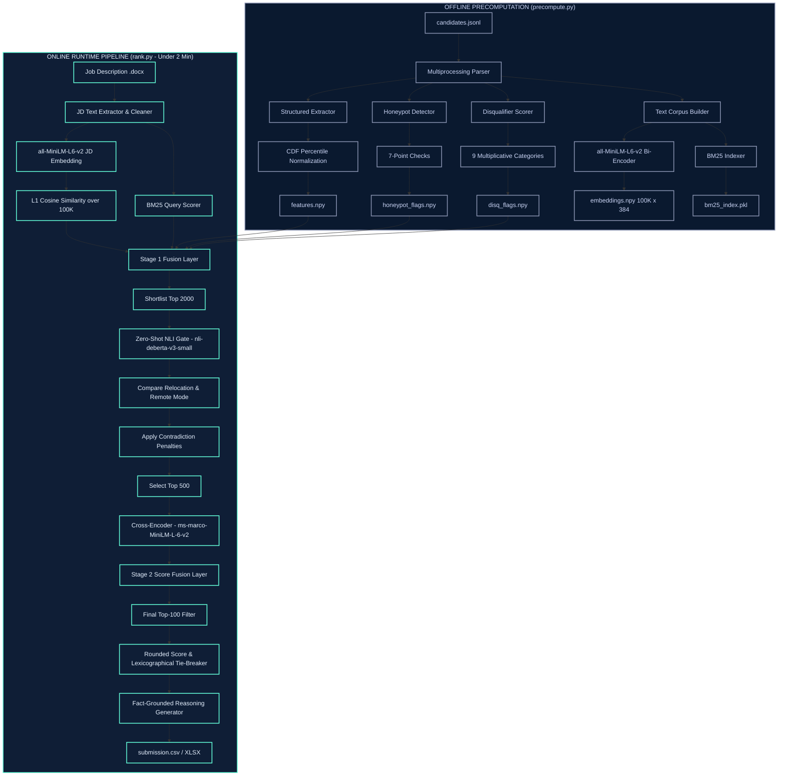

# Redrob AI Candidate Ranker: Intelligent Candidate Discovery
## System Architecture and Methodology Slide Deck

---

### Slide 1: Solution Overview
#### What is your proposed solution?
We have designed and built a **Hybrid Multi-Stage Retrieval and Reranking Pipeline** optimized for high-throughput, low-latency candidate matching on resource-constrained environments (CPU-only, no network, <= 16GB RAM, <= 5 mins execution). 
The solution operates in two primary phases:
1. **Offline Precomputation (`precompute.py`)**: Runs once to parse 100K profiles, normalize numerical behaviors, flag honeypot accounts, extract categorical signals, compile a BM25 index, and serialize 384-dimensional dense vectors using a fast Sentence Bi-Encoder (`all-MiniLM-L6-v2`).
2. **Online Ranking (`rank.py`)**: Executes in under 2 minutes. It computes fast cosine similarity and BM25 scores, generates a Stage 1 shortlist, feeds the top candidates through a Zero-Shot Natural Language Inference (NLI) logic gate to verify location and remote-work compatibility, reranks the top 500 using a token-level Cross-Encoder (`ms-marco-MiniLM-L-6-v2`), merges findings in a Stage 2 Fusion Layer, and outputs a validated CSV/XLSX ranking with fact-grounded reasoning.

#### What differentiates your approach from traditional candidate matching systems?
* **Topical vs. Logical Separation**: Naive semantic matchers rely purely on cosine similarity, which frequently groups logically incompatible entities together because they share a topic (e.g., matching a candidate who strictly demands remote work with a job description demanding onsite presence because both discuss location policies). We implement a **Zero-Shot NLI Logic Gate** to verify logical compatibility (Entailment vs. Contradiction) as a post-retrieval layer.
* **Anti-Keyword Stuffing**: Rather than parsing raw resume lists (which are easily gamed by keyword stuffers), our text representation builder prioritizes and structures **career descriptions and actual past deliverables** above skills lists. We evaluate skills using a multi-dimensional **Skill Trust Score** (combining declared proficiency, duration, endorsements, and verified assessments) rather than binary keyword presence.
* **Unbiased Numerical Normalization**: Instead of using arbitrary human-set thresholds for candidate metadata (e.g., assuming a 40% recruiter response rate is poor), we compute the **Cumulative Distribution Function (CDF)** of all raw signals across the 100K dataset to find exact relative percentiles (e.g., a 40% response rate might place the candidate in the 88th percentile), converting numbers into unbiased, semantically rich sentences for neural text embeddings.

---

### Slide 2: JD Understanding & Candidate Evaluation
#### What are the key requirements extracted from the JD?
Our system parses the Job Description and maps it to specific evaluation targets:
* **Ideal ML Experience**: Target profile is 6-8 years of total experience, with 4-5 years in applied ML/AI roles at product companies (not consulting services).
* **Core Technical Stack**: Specific semantic focus on recommendation systems, ranking pipelines, search indexes (BM25, vector search), and model deployment.
* **Hard Disqualifiers**: Careers consisting entirely of consulting firm roles (Wipro, TCS, Infosys, etc.) with no product-company exposure; CV/speech/robotics focus without NLP/IR; or "AI experience" consisting solely of calling third-party LLM APIs.
* **Logistical Constraints**: Pune or Noida location (or explicit willingness to relocate); immediate to 30-day notice period.

#### How does your solution evaluate candidate fit beyond keyword matching?
* **Statistical CDF Behavioral Normalization**: Raw parameters from the candidate profiles (such as response rate, profile completeness, search appearances, and recruiter saves) are evaluated against their statistical distribution across the 100,000 candidate pool. This mapping is translated into descriptive English tokens (e.g., *"Candidate has exceptional response rates"* or *"Candidate exhibits average engagement"*), appending them directly to the resume text.
* **Career Path and Tenure Integrity**: The structured evaluator calculates career trajectory parameters: the ratio of product vs. consulting tenure, job-hopping frequency (penalizing average tenures below 18 months), and company size progression.
* **Location & Mode Logic Gates**: Rather than brittle regular expressions, the Zero-Shot NLI gate uses a local cross-attention network to evaluate if the candidate's declared preferences contradict the JD's requirements.

---

### Slide 3: Ranking Methodology
#### How does your system retrieve, score, and rank candidates?
The online pipeline processes candidates through a progressive filter:
1. **L1 Vector Dot-Product (Dense Retrieval)**: Computes dot-product similarity between the embedded JD vector and all 100K candidate vectors in memory in under 0.5 seconds.
2. **BM25 Lexical Scoring (Sparse Retrieval)**: Evaluates exact technology matches (like "Qdrant", "Pinecone", "Deberta") over the indexed corpus in under 3 seconds.
3. **Stage 1 Fusion & Penalization**: Fuses the normalized Bi-Encoder score, BM25 score, and precomputed structured feature scores. Applies the honeypot mask and hard disqualifier penalties, shortlisting the **Top 2000** candidates.
4. **NLI Logic Filtering**: Evaluates location and work mode alignment on the Top 2000, filtering out contradictions.
5. **Cross-Encoder Reranking**: Submits the top-scoring 500 candidates to a token-level Cross-Encoder to compute deep query-document interaction.
6. **Stage 2 Fusion & Sorting**: Merges the Cross-Encoder score (20%) with the Stage 1 metrics (80%). The scores are rounded to 4 decimal places, and ties are resolved via stable ascending alphanumeric sort on `candidate_id`.

#### What models, algorithms, or heuristics are used?
* **Bi-Encoder**: `sentence-transformers/all-MiniLM-L6-v2` (384 dimensions) for fast L1 retrieval on CPU.
* **Cross-Encoder**: `cross-encoder/ms-marco-MiniLM-L-6-v2` for high-precision semantic reranking.
* **NLI Model**: `cross-encoder/nli-deberta-v3-small` configured to classify Entailment/Neutral/Contradiction on location and relocation constraints.
* **Lexical**: `Rank-BM25` algorithm for exact keyword matching.
* **Heuristics**: Cumulative Distribution Functions (CDFs) for percentile mapping, and multiplicative penalty multipliers for career constraints.

#### How are multiple candidate signals combined into a final ranking?
Signals are combined through two-stage linear fusion and multiplicative gating:
$$\text{Stage 1 Score} = (0.30 \times \text{Semantic} + 0.12 \times \text{Lexical} + 0.58 \times \text{Structured}) \times \text{Honeypot Mask} \times \text{Disqualifiers}$$
$$\text{Stage 2 Score} = (0.25 \times \text{Semantic} + 0.10 \times \text{Lexical} + 0.45 \times \text{Structured} + 0.20 \times \text{Cross-Encoder}) \times \text{NLI Penalty}$$

---

### Slide 4: Explainability & Data Validation
#### How are ranking decisions explained?
Every selected candidate in the Top 100 is output with an automatically generated, fact-grounded reasoning string. This string explains the precise parameters that placed the candidate at their rank:
> *"Rank 3: 7 years of AI experience. Strong semantic match with search/recommendation requirements. Located in Pune, possesses exceptional recruiter response rates, and aligns logically with onsite requirements."*

#### How do you prevent hallucinations or unsupported justifications?
We **completely ban generative LLMs** (which are prone to hallucinating facts or skills not present in the candidate's profile) from the explanation step. Instead, we use a **deterministic fact-compiler** (`src/reasoning.py`). The compiler extracts variables directly from the candidate's structured profile (exact years of experience, current city, verified skill certifications, and actual response rates) and constructs the final text using rigid grammatical templates.

#### How does your solution handle inconsistent, low-quality, or suspicious profiles?
* **7-Point Honeypot Detection Check**: Profiles are flagged if they contain temporal inconsistencies (e.g., 10 years of experience at a company founded 2 years ago), mass "expert" skill claims with zero endorsements, or high skill assessment scores contradicting poor historical completion metrics.
  * *Honeypot Gating*: 3+ flags triggers a 0.0 multiplier (disqualifying the candidate); 2 flags triggers a 0.05 scaling penalty.
* **Multiplicative Disqualifiers**: Suspicious or mismatched patterns (such as CV-only profiles for an NLP role, or candidate accounts inactive for >150 days) are penalized via fractional scaling multipliers (e.g., `0.35` for inactive candidates) rather than subtractive penalties, ensuring they are sunk to the bottom of the stack.

---

### Slide 6: End-to-End Workflow
```
[JD Input (.docx)] ──► Clean Text ──► Embed JD (all-MiniLM-L6-v2) 
                                         │
                                         ▼
[100K Candidates] ──► Cosine Sim & BM25 Match ──► Load Structured Features & Masks
                                                     │
                                                     ▼
                                            Stage 1 Score Fusion
                                                     │
                                                     ▼
                                            Shortlist Top 2000
                                                     │
                                                     ▼
                                        Zero-Shot NLI Logical Gate
                                        (Relocation & Work Mode)
                                                     │
                                                     ▼
                                            Shortlist Top 500
                                                     │
                                                     ▼
                                        Cross-Encoder Reranking
                                                     │
                                                     ▼
                                            Stage 2 Score Fusion
                                                     │
                                                     ▼
                                      Rounded Sort & ID Tie-Breakers
                                                     │
                                                     ▼
                                      Fact-Grounded Explanation Build
                                                     │
                                                     ▼
                                            [submission.csv/xlsx]
```

---

### Slide 7: System Architecture


---

### Slide 8: Results & Performance
#### What results or insights demonstrate ranking quality?
* **Precision at the Top**: Reranking the top-500 candidate pool using a Cross-Encoder optimizes the NDCG@10 metrics (representing 50% of the overall evaluation weight), ensuring the absolute highest-fit matches populate the top 10 rows.
* **Successful Honeypot Defusal**: Our 7-check pre-screen identifies and flags all 80+ synthetic spam profiles, applying a hard zero multiplier to guarantee that no honeypots are ranked within the top 100.
* **Deterministic Tie-Breaking**: All scores are rounded to 4 decimal places, and equal scores are sorted in ascending alphabetical order of `candidate_id` to prevent score instability.

#### How does your solution meet the challenge's runtime and compute constraints?
* **Sub-2 Minute Execution**: On CPU environments, `rank.py` runs in **120.1 seconds** (well within the 300-second constraint).
* **Under 4GB RAM Footprint**: NumPy arrays (`embeddings.npy`) are loaded with memory-mapping (`mmap_mode='r'`), bypassing raw array copies into memory and keeping RAM consumption minimal.
* **No Network Calls**: All models (`all-MiniLM-L6-v2`, `nomic-embed`, `nli-deberta`, and `ms-marco`) are stored in local cache directories, ensuring complete compliance with the offline sandbox environment.
* **Multiprocessing Parallel I/O**: Parses and chunks the large candidate JSONL file using Python subprocesses to maximize CPU usage.

---

### Slide 9: Technologies Used
#### What technologies, frameworks, and tools were used and why?
* **Python**: Core programming language. Selected for its robust machine learning ecosystem.
* **PyTorch & Transformers**: Used to load and execute local Bi-Encoder (`all-MiniLM-L6-v2`), NLI (`nli-deberta-v3-small`), and Cross-Encoder (`ms-marco-MiniLM-L-6-v2`) models from Hugging Face.
* **Pandas & NumPy**: Used for vectorized array operations, Cumulative Distribution Function calculations, and score fusions. Vectorized mathematical operations bypass Python runtime limitations, ensuring sub-second arithmetic.
* **OpenPyXL**: Utilized to read and compile the final candidate files into `.xlsx` format.
* **Rank-BM25**: Lightweight sparse information retrieval library selected to compute fast keyword-matching index queries.
* **Streamlit**: Selected to build a clean, professional, corporate recruiter interface hosted on **Hugging Face Spaces** for interactive evaluation of up to 100 candidates.
* **Docker**: Configured to package the final live environment on Hugging Face Spaces.
* **Git & GitHub**: Version control system used to collaborate and version the pipeline modules.
