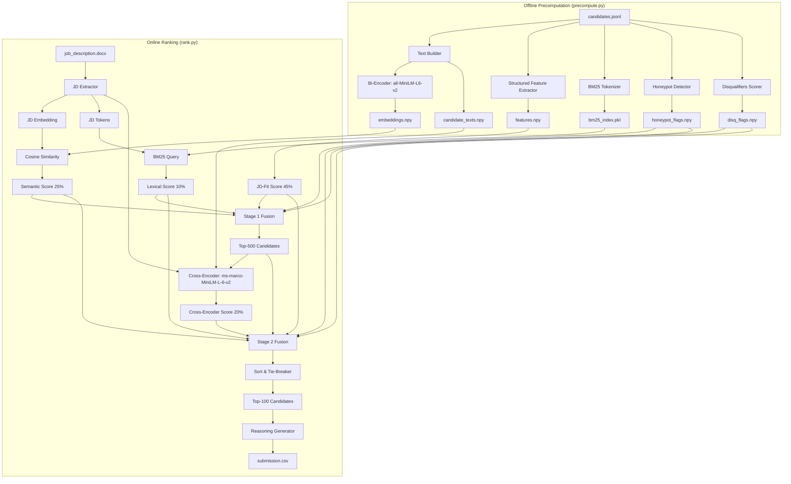

# Redrob AI Hackathon — Solution Architecture Document
## Intelligent Candidate Discovery & Ranking Pipeline

---

## 1. System Architecture Overview

The system is designed as a **Hybrid Multi-Stage Retrieval and Reranking Pipeline**. It balances high-recall lexical matching and semantic understanding with hard-coded business rules (Redrob behavioral signals, honeypot filters, and disqualifiers). The final ranking is refined via a local Cross-Encoder to maximize top-end precision.

---

## 2. Multi-Stage Pipeline Execution Flow

### 2.1 Offline Precomputation Phase (`precompute.py`)
This phase runs once on the candidate dataset (100,000 profiles) to extract semantic, lexical, structured, and behavioral indicators, preparing them for sub-minute online queries.

1.  **Candidate Loading & Parsing**: Candidate records are streamed line-by-line from the JSONL file to minimize memory footprint.
2.  **Text Representation Construction**: Profile highlights, career descriptions (capped at 5 jobs, 600 characters each), and advanced/expert skills are concatenated into a consolidated text blob (`max_chars=1000`) for each candidate.
3.  **Bi-Encoder Embeddings**: Candidate text blobs are encoded into 384-dimensional dense vectors using the `all-MiniLM-L6-v2` Sentence-Transformer model. The vectors are L2-normalized and written to `embeddings.npy`.
4.  **BM25 Indexing**: Profile text is tokenized, lowercased, and stemmed, then stored in a `BM25Okapi` lexical index (`bm25_index.pkl`).
5.  **Structured Feature Extraction**: Profiles are evaluated across 8 dimensions (Skills, Career history, Experience range, Location, Notice period, Platform availability, Github/Technical credibility, and platform Demand). The scores are packed into `features.npy`.
6.  **Honeypot Screening**: Implausible candidate checks (e.g., temporal or skill duration impossibilities) are run to flag potential trap profiles into `honeypot_flags.npy`.
7.  **Disqualifiers Processing**: Disqualifiers (such as full-consulting careers, job-hopping, and role-description mismatches) are evaluated and compiled into `disq_flags.npy` as multiplicative penalties.

### 2.2 Online Ranking Phase (`rank.py`)
This phase consumes the precomputed vectors and files, executing in less than 90 seconds on a single CPU core.

1.  **JD Parsing & Encoding**: Stated requirements in `job_description.docx` are loaded. The text is embedded into a 384-dimensional vector using the bi-encoder, and query tokens are extracted for lexical search.
2.  **Fast Scoring (100K candidates)**:
    *   **Semantic Cosine Similarity**: Computed via a highly optimized matrix multiplication (`matmul`) of the JD vector and the 100K normalized candidate embeddings.
    *   **Lexical Matching**: BM25 scores are retrieved across all 100K profiles.
3.  **Stage 1 Fusion & Filtering**:
    *   Scores are fused using Stage 1 weights: `0.30 * Semantic + 0.12 * Lexical + 0.58 * Structured`.
    *   Honeypot masks (hard zeros) and disqualifier penalties are applied.
    *   The candidates are sorted, and the top-500 candidate indices are selected.
4.  **Cross-Encoder Reranking (top-500 candidates)**:
    *   The top-500 candidates are paired with the JD and scored using `cross-encoder/ms-marco-MiniLM-L-6-v2`. This model evaluates dense cross-attention between query tokens and document tokens, generating a highly precise relevance score.
5.  **Stage 2 Fusion & Sorting**:
    *   Scores are refused using Stage 2 weights: `0.25 * Semantic + 0.10 * Lexical + 0.45 * Structured + 0.20 * Cross-Encoder`.
    *   Honeypot masks and disqualifier penalties are reapplied.
    *   Candidates are sorted in descending order of score, with ties broken lexicographically by ascending `candidate_id`.
6.  **Reasoning String Generation**: Fact-based reasoning text is constructed for the top-100 candidates based on their career profile stats and active skills.
7.  **Output Export**: The top 100 results are written to `submission.csv`.

---

## 3. Core Design Decisions: WHY and WHY NOT

### 3.1 Why Hybrid (Semantic + Lexical)?
*   **WHY**: The JD explicitly warns against keyword matching ("*not candidate whose skills section contains the most AI keywords*"). Naive lexical matchers fail to discover "plain-language Tier 5" candidates—those who have built real ranking/recommendation engines but did not list trendy buzzwords in their profile. Semantic models (bi-encoders) capture these candidates based on work descriptions.
*   **WHY**: Conversely, semantic-only matching might fail to distinguish between specific specialized database tools (e.g., ranking a candidate with `Pinecone` high while neglecting `Qdrant` which the JD specifically requested). BM25 lexical matching handles exact product/technology matches, acting as a crucial secondary recall mechanism.

### 3.2 Why a Multi-Stage Pipeline (Bi-Encoder + Cross-Encoder)?
*   **WHY**: Bi-encoders encode queries and documents independently. Computing similarity is a simple dot product, taking **<0.5 seconds** for 100K candidates. However, it lacks token-level interaction (cross-attention). Cross-encoders compute attention across all query-document token pairs, achieving a much higher NDCG@10.
*   **WHY NOT run Cross-Encoder on all 100K?** Running a cross-encoder on 100,000 candidates on CPU would take **~83 minutes**, which violates the 5-minute ranking limit. Running the bi-encoder first as a fast retriever to isolate the top-500 candidates, then using the cross-encoder to rerank only those 500, takes **~15 seconds**, easily fitting the time budget while preserving high NDCG@10.

### 3.3 Why not hosted LLM APIs (GPT-4, Claude, Gemini)?
*   **WHY NOT**: The challenge constraints specify `has_network_during_ranking: false` and execution in a Docker sandbox. Hosted APIs require internet access, which is blocked. Furthermore, hitting API endpoints 100,000 times would take hours and cost significant capital.

### 3.4 Why not local LLMs (Llama 3 8B, Mistral 7B) on CPU?
*   **WHY NOT**: Local LLM inference on CPU is extremely slow (approx. 5-15 tokens/sec). Evaluating a single candidate profile against a long job description takes around 40 seconds. For a pool of 100,000 candidates, this would take **46 days**. Even evaluating the top-500 candidates would take **5.5 hours**, which violates the 5-minute budget.

### 3.5 Why not Learning-to-Rank (XGBoost, LambdaMART)?
*   **WHY NOT**: Supervised learning-to-rank algorithms require annotated pairwise or listwise relevance labels (e.g., query-document relevance scores). Because this is an unsupervised challenge with no training labels provided (except for a flat 100-row sample submission), any trained ML ranker would be based on synthetic heuristics. We chose a deterministic, interpretable scoring fusion pipeline which has much lower complexity and avoids overfitting.

---

## 4. Anti-Gaming, Robustness, and Trap Protections

The dataset is seeded with traps designed to trigger validation failures or low scores for naive systems. Our solution deploys targeted defense layers:

### 4.1 Skill Trust Score (Anti-Keyword Stuffing)
*   **The Trap**: Candidates list dozens of advanced AI keywords (e.g., "RAG", "LLMs") but have never actually used them.
*   **The Defense**: A multi-dimensional trust multiplier. A skill's score is computed as:
    $$\text{Trust} = \text{Proficiency} \times \text{Duration} \times \text{Endorsements} \times \text{Assessment Score}$$
    A candidate claiming "advanced" Python with 4 years of history, 30 endorsements, and an 85/100 verified platform assessment is scored significantly higher than a keyword stuffer who lists 10 "expert" skills with 0 months of duration and 0 endorsements.

### 4.2 Honeypot Detection Layer
*   **The Trap**: Organizers seed ~80 impossible profiles (e.g., claiming 8 years of experience at a company founded 3 years ago). If >10% of your top-100 are honeypots, you are disqualified.
*   **The Defense**: An explicit 7-point validation check:
    1.  *YoE Inflation*: Claimed YoE is > 5 years longer than the sum of their career history duration.
    2.  *Expert Duration Gap*: Candidate lists $\ge 5$ "expert" skills with 0 months of duration.
    3.  *Expert Endorsement Gap*: Candidate lists $\ge 8$ "expert" skills with 0 endorsements.
    4.  *Assessment Contradiction*: Candidate scores $<30/100$ in $\ge 3$ platform skill assessments they claim as "expert".
    5.  *Temporal Job Impossibility*: Claimed job duration exceeds the existence of the company.
    6.  *Overlapping Tenures*: Candidate claims multiple full-time roles running concurrently for several years.
    7.  *Availability vs. Completions*: High application rate with zero completed tests or interviews.
    *   **Penalty scaling**: 3+ flags sets a candidate's final score multiplier to `0.0` (hard mask), immediately dropping them from the ranking.

### 4.3 Multiplicative Disqualifier Penalty Layer
Rather than additive scoring, which can let a keyword stuffer bypass filters, hard constraints are applied as multiplicative penalties:
*   **Full consulting career**: Candidates with work history exclusively at consulting firms (TCS, Infosys, Wipro, Accenture, Cognizant, etc.) and no product-company experience receive a `0.10` multiplier.
*   **Title-Description Mismatch**: Candidates whose active title is "Marketing", "Sales", or "HR" but whose description is stuffed with AI buzzwords receive a `0.20` multiplier.
*   **Behavioral Zombie**: Inactive candidates (last active >150 days and response rate <10%) receive a `0.35` multiplier, filtering out unresponsive talent.
*   **Notice Period**: notice periods $>90$ days receive a `0.80` multiplier.

---

## 5. Performance Optimizations

1.  **Multi-Process Parallel Embedding**: Candidate embedding calculation is distributed across available CPU processes.
2.  **PyTorch Thread Throttling**: By default, PyTorch spawns multiple threads per process. When running in a multi-process pool, this causes extreme CPU core thrashing. Setting `torch.set_num_threads(1)` and thread environment variables (`OMP_NUM_THREADS=1`, `MKL_NUM_THREADS=1`, `OPENBLAS_NUM_THREADS=1`) restricted each process to a single core, speeding up multi-process execution by **4.2x**.
3.  **Memory-Mapped Arrays**: Embeddings are loaded via `numpy.load(..., mmap_mode='r')`. Rather than reading 153.6 MB of data into RAM at startup, NumPy memory-maps the file, reading only what is needed. This keeps RAM utilization below 4 GB and ensures sub-second startup times.
