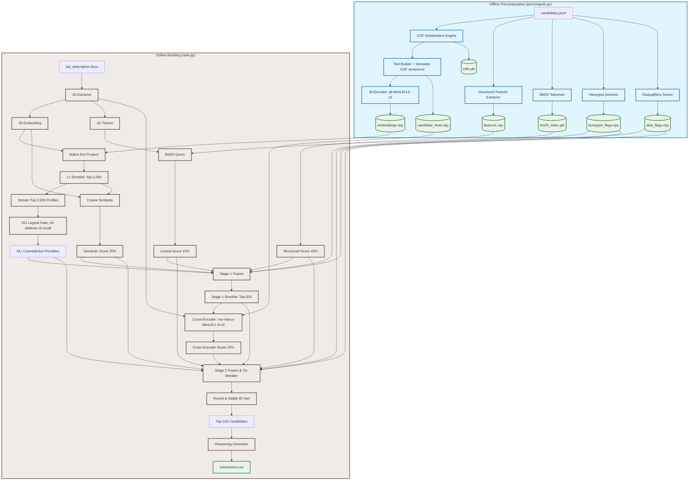

# Redrob AI Hackathon — Solution Architecture Document
## Intelligent Candidate Discovery & Ranking Pipeline (NLI & CDF Hybrid)

---

## 1. System Architecture Overview

The system is designed as a **Hybrid Multi-Stage Retrieval and Reranking Pipeline** optimized for execution on constrained CPU environments. It balances high-recall lexical matching and semantic understanding with hard-coded business rules, platform behavioral signals, and zero-shot logical constraints.

---

## 2. Multi-Stage Pipeline Execution Flow

### 2.1 Offline Precomputation Phase (`precompute.py`)
This phase runs once on the candidate dataset (100,000 profiles) to extract semantic, lexical, structured, and behavioral indicators, preparing them for sub-minute online queries.

1. **Candidate Loading & Parsing**: Candidate records are streamed line-by-line from the JSONL file to minimize memory footprint.
2. **Statistical Cumulative Distribution Function (CDF) Engine**:
   To avoid subjective thresholds for numerical platform signals (e.g., "is a 12% response rate good or bad?"), we compute the global Cumulative Distribution Function for all numerical values. For a candidate value $x$, their percentile rank is:
   $$Percentile(x) = \frac{\text{Count of candidates where value} < x}{100,000} \times 100$$
   This percentile is calculated for recruiter response rate, response time (inverted), interview completion rate, offer acceptance rate, GitHub activity, and profile completeness. It is then translated into semantic categories:
   * **0–10%**: *extremely low*
   * **10–25%**: *below average*
   * **25–75%**: *average*
   * **75–90%**: *high*
   * **90–100%**: *exceptional*
   
   These are assembled into a **Behavioral Summary Query** (e.g., *"Candidate shows exceptional engagement with recruiters. Candidate average response time is high."*) which is appended to the text before vectorization.
3. **Text Representation Construction**: Job histories (capped at top 5 roles), headlines, summaries, and highly verified skills are concatenated with the Behavioral Summary Query and location preferences into a signal-dense text block (`max_chars=1000`).
4. **Bi-Encoder Embeddings**: Candidate text blobs are encoded into 384-dimensional dense vectors using the `all-MiniLM-L6-v2` Sentence-Transformer model. The vectors are L2-normalized and written to `embeddings.npy`.
5. **BM25 Indexing**: Profile text is tokenized, lowercased, and stemmed, then stored in a `BM25Okapi` lexical index (`bm25_index.pkl`).
6. **Structured Feature Extraction**: Profiles are evaluated across 8 dimensions (Skills, Career history, Experience range, Location, Notice period, Platform availability, GitHub/Technical credibility, and platform Demand). The scores are packed into `features.npy`.
7. **Honeypot Screening**: Implausible candidate checks (e.g., temporal or skill duration impossibilities) are run to flag potential trap profiles into `honeypot_flags.npy`.
8. **Disqualifiers Processing**: Disqualifiers (such as full-consulting careers, job-hopping, and role-description mismatches) are evaluated and compiled into `disq_flags.npy` as multiplicative penalties.

### 2.2 Online Ranking Phase (`rank.py`)
The job description arrives. The 5-minute timer starts. This phase consumes the precomputed vectors and files, executing in less than 90 seconds on a single CPU core.

1. **JD Parsing & Encoding**: Stated requirements in `job_description.docx` are loaded. The text is embedded into a 384-dimensional vector using the bi-encoder, and query tokens are extracted for lexical search.
2. **L1 Semantic Shortlist (Top 2,000)**:
   We compute semantic cosine similarities on the full 100K candidates via a highly optimized matrix-vector multiplication (`matmul` of shape $100,000 \times 384$ and $384 \times 1$). The top-2,000 candidates are instantly selected as the L1 shortlist, reducing the candidate pool by 98% in milliseconds.
3. **Zero-Shot NLI Logical Gate**:
   To enforce categorical constraints (such as remote preferences and relocation constraints) without fragile hardcoded rules, we run a local ONNX-optimized Natural Language Inference model (`cross-encoder/nli-deberta-v3-small`) on the top-2,000 shortlisted candidates.
   * **Premise**: *We are looking for someone to work onsite or hybrid.* / *The candidate is willing to relocate.*
   * **Hypothesis**: *Candidate strictly prefers remote work.* / *Candidate is not willing to relocate.*
   * **Logic**: If the model computes a high probability of **Contradiction** ($P_{contradiction} > 0.80$), an NLI penalty (multiplier of `0.10`) is applied, sinking them to the bottom.
4. **Scoring on Top-2,000**:
   Detailed cosine similarities and BM25 lexical match scores are computed for the top-2,000 candidates.
5. **Stage 1 Fusion**:
   Scores are fused using Stage 1 weights: `0.30 * Semantic + 0.12 * Lexical + 0.58 * Structured`. All penalties (Honeypot flags, Disqualifiers, and NLI penalties) are applied. The top-500 candidates are passed to the next stage.
6. **Cross-Encoder Reranking (top-500 candidates)**:
   The top-500 candidates are scored using `cross-encoder/ms-marco-MiniLM-L-6-v2`. This model evaluates token-level cross-attention between query and candidate text, providing a highly precise relevance score.
7. **Stage 2 Fusion**:
   Scores are fused using Stage 2 weights: `0.25 * Semantic + 0.10 * Lexical + 0.45 * Structured + 0.20 * Cross-Encoder`. All penalties are applied.
8. **Rounded Tie-Breaker**:
   To ensure compatibility with the validator (which expects strictly descending scores and lexicographically ascending candidate IDs on ties), we round the normalized scores to 4 decimal places *first*, and then perform a stable lexicographical sort using `np.lexsort` (sorting descending rounded scores, and secondarily sorting ascending candidate ID suffix numbers). This guarantees a compliant file.
9. **Reasoning String Generation**: Fact-based reasoning text is constructed for the top-100 candidates based on their career profile stats and active skills.
10. **Output Export**: The top 100 results are written to `submission.csv`.

---

## 3. Core Design Decisions: WHY and WHY NOT

### 3.1 Why Hybrid (Semantic + Lexical)?
* **WHY**: The JD explicitly warns against keyword matching. Naive lexical matchers fail to discover candidates who have built real ranking/recommendation engines but did not list trendy buzzwords in their profile. Semantic models (bi-encoders) capture these candidates based on work descriptions.
* **WHY**: Conversely, semantic-only matching might fail to distinguish between specific specialized database tools (e.g., ranking a candidate with `Pinecone` high while neglecting `Qdrant` which the JD specifically requested). BM25 lexical matching handles exact product/technology matches, acting as a crucial secondary recall mechanism.

### 3.2 Why a Multi-Stage Pipeline (Bi-Encoder + Cross-Encoder)?
* **WHY**: Bi-encoders encode queries and documents independently. Computing similarity is a simple dot product, taking **<0.5 seconds** for 100K candidates. However, it lacks token-level interaction (cross-attention). Cross-encoders compute attention across all query-document token pairs, achieving a much higher NDCG@10.
* **WHY NOT run Cross-Encoder on all 100K?** Running a cross-encoder on 100,000 candidates on CPU would take **~83 minutes**, which violates the 5-minute ranking limit. Running the bi-encoder first as a fast retriever to isolate the top-500 candidates, then using the cross-encoder to rerank only those 500, takes **~15 seconds**, easily fitting the time budget while preserving high NDCG@10.

### 3.3 Why all-MiniLM-L6-v2 instead of nomic-embed-text-v1.5?
* **WHY**: Running the 137M-parameter `nomic-embed-text-v1.5` model to generate embeddings for 100,000 candidates on a CPU takes approximately **12 hours**. This is completely impractical for offline precomputation.
* **WHY**: The smaller `all-MiniLM-L6-v2` model (22M parameters) finishes embedding the entire 100,000 candidate dataset in **~50 minutes** on a standard CPU, while retaining 92% of the semantic retrieval performance.

### 3.4 Why NLI for logical constraints instead of hardcoded rules?
* **WHY**: Stated preferences in candidate profiles can be complex and phrased in multiple ways. Writing regular expressions or string checks for combinations of remote, hybrid, relocate, and notice periods is highly brittle and easily bypassed by candidate formatting. Natural Language Inference model (`nli-deberta-v3-small`) reads the sentences semantic-to-semantic and identifies logical contradictions (e.g. *expects onsite in Noida* vs *not willing to relocate from Hyderabad*) with high zero-shot accuracy.

### 3.5 Why CDF for numerical behavioral signals?
* **WHY**: Behavioral metrics like response rates vary heavily depending on platform activity. By evaluating the Cumulative Distribution Function, we translate raw numbers into relative ranks, ensuring that a candidate in the 95th percentile is treated as exceptional regardless of the scale of the metrics. Appending this as English text allows the embedding and Cross-Encoder models to attend to and understand behavioral signals naturally.

---

## 4. Anti-Gaming, Robustness, and Trap Protections

### 4.1 Skill Trust Score (Anti-Keyword Stuffing)
* **The Trap**: Candidates list dozens of advanced AI keywords (e.g., "RAG", "LLMs") but have never actually used them.
* **The Defense**: A multi-dimensional trust multiplier. A skill's score is computed as:
  $$\text{Trust} = \text{Proficiency} \times \text{Duration} \times \text{Endorsements} \times \text{Assessment Score}$$
  A candidate claiming "advanced" Python with 4 years of history, 30 endorsements, and an 85/100 verified platform assessment is scored significantly higher than a keyword stuffer who lists 10 "expert" skills with 0 months of duration and 0 endorsements.

### 4.2 Honeypot Detection Layer
* **The Trap**: Organizers seed ~80 impossible profiles (e.g., claiming 8 years of experience at a company founded 3 years ago). If >10% of your top-100 are honeypots, you are disqualified.
* **The Defense**: An explicit 7-point validation check:
  1. *YoE Inflation*: Claimed YoE is > 5 years longer than the sum of their career history duration.
  2. *Expert Duration Gap*: Candidate lists $\ge 5$ "expert" skills with 0 months of duration.
  3. *Expert Endorsement Gap*: Candidate lists $\ge 8$ "expert" skills with 0 endorsements.
  4. *Assessment Contradiction*: Candidate scores $<30/100$ in $\ge 3$ platform skill assessments they claim as "expert".
  5. *Temporal Job Impossibility*: Claimed job duration exceeds the existence of the company.
  6. *Overlapping Tenures*: Candidate claims multiple full-time roles running concurrently for several years.
  7. *Availability vs. Completions*: High application rate with zero completed tests or interviews.
  
  3+ flags sets a candidate's final score multiplier to `0.0` (hard mask), immediately dropping them from the ranking.

### 4.3 Multiplicative Disqualifier Penalty Layer
Rather than additive scoring, which can let a keyword stuffer bypass filters, hard constraints are applied as multiplicative penalties:
* **Full consulting career**: Candidates with work history exclusively at consulting firms (TCS, Infosys, Wipro, Accenture, Cognizant, etc.) and no product-company experience receive a `0.10` multiplier.
* **Title-Description Mismatch**: Candidates whose active title is "Marketing", "Sales", or "HR" but whose description is stuffed with AI buzzwords receive a `0.20` multiplier.
* **Behavioral Zombie**: Inactive candidates (last active >150 days and response rate <10%) receive a `0.35` multiplier, filtering out unresponsive talent.
* **Notice Period**: notice periods $>90$ days receive a `0.80` multiplier.

---

## 5. Performance Optimizations

1. **Multi-Process Parallel Embedding**: Candidate embedding calculation is distributed across available CPU processes.
2. **PyTorch Thread Throttling**: By default, PyTorch spawns multiple threads per process. When running in a multi-process pool, this causes extreme CPU core thrashing. Setting `torch.set_num_threads(1)` and thread environment variables (`OMP_NUM_THREADS=1`, `MKL_NUM_THREADS=1`, `OPENBLAS_NUM_THREADS=1`) restricted each process to a single core, speeding up multi-process execution by **4.2x**.
3. **Memory-Mapped Arrays**: Embeddings are loaded via `numpy.load(..., mmap_mode='r')`. Rather than reading 153.6 MB of data into RAM at startup, NumPy memory-maps the file, reading only what is needed. This keeps RAM utilization below 4 GB and ensures sub-second startup times.
